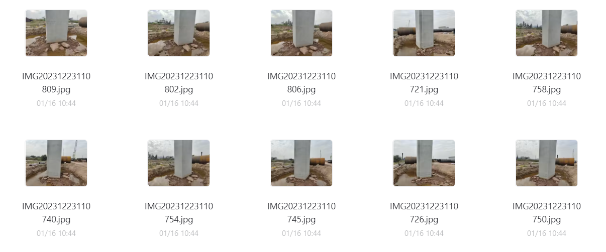

## Repository Directory Structure

- cc-pipeline       // the 3D reconstruction pipeline based on contextCapture
- DPT-main         // single-view depth prediction algorithm
- RPMNet            // same source point cloud registration algorithm，see [yewzijian/RPMNet: RPM-Net: Robust Point Matching using Learned Features (CVPR2020) (github.com)](https://github.com/yewzijian/RPMNet)
- tools                  // A series of tools used for handling modal transformations, etc
- colmap-pipeline.py            // colmap interface，see [COLMAP — COLMAP 3.9-dev documentation](https://colmap.github.io/index.html)
- BinocularDisparity             // Binocular depth estimation algorithm, including methods for generating point clouds, with high memory requirements

## Tools Description

the file name indicates the function of the method, and some functions need to adjust their corresponding parameters based on the actual camera parameters and imaging results used, such as the image HW parameter and camera intrinsics in rgbd2ply.py.

## RPMNet

RPMNet is a homologous point cloud registration method based on modelnet40 training, which has better performance, but there are also more superior methods, such as DGR. It is recommended to pay attention to the SOTA model.

## Colmap

A very useful integrated 3D reconstruction tool that provides simple API calls, as shown in the pipeline, and also provides an open-source project with a graphical interface. The effect is also good and suitable for getting started. See details for more information https://colmap.github.io/index.html.

Colmap can be executed without providing camera intrinsic parameters, but it would be better to have specific camera intrinsic parameters. If extrinsic parameters can also be obtained, it would be an added bonus.

Suggest compiling colmap on Linux.

Colmap provides a sample dataset, and one demo has been uploaded to the cloud storage pcd dataset, specifically named pc south building. The effect of dense reconstruction using Colmap method is shown in the figure.

## ContextCapture

Powerful 3D reconstruction method, providing API support and graphical interface. The specific calling method is shown in automaster.exe of cc pipeline. The corresponding parameters need to be modified according to your own needs, such as the output format (obj/ply/fbx...). To call the API, you need to first install the WHL file and CC. The file has been transferred to the cloud drive.

## DPT-main 

Single view depth estimation algorithm, as an efficient method for depth estimation, is used as an intermediate process for converting RGB images into point cloud.

## BinocularDisparity

The binocular depth estimation algorithm using STereo TRansformer (STTR) as the pipeline has better performance compared to DPT algorithm, and includes a pipeline from binocular RGB images to single view 3D point cloud mapping. The relevant parameters of the method need to be changed by oneself, and the model is on the cloud storage. For specific content, please refer to the official open source project of STTR.

## 3D Model Visualization Methods

We recommend using Open3D directly for visualization. Our tools provide helper code for visualization. Of course, you can also use other tools such as Blender, Unity, or MeshLab for visualization.

## About Point Cloud Model

Point cloud models can be visualized after voxel downsampling with the help of Open3D. The two different densities of point clouds (180,000 points and 720,000 points) shown in the online drive video are generated by two different sampling rates.

## Data Collection Precautions

- Ensure a high overlap rate of images during sampling, at least 30%. For more detailed information, please refer to the official documentation of colmap or cc.
- Variations in light intensity during the collection process can affect the quality of the model. It is advisable to collect data when the light is stable, and the light should not be too bright.
- Be sure to exclude images with ghosting or blur.
- If the object consists of inner and outer rings, it is necessary to collect images from both rings and additionally from a diagonal overhead perspective to prevent the outer ring from adhering to the inner ring.
- Be aware of the imaging principles of different types of depth cameras and pay attention to the corresponding imaging environment requirements.
- If conditions permit, it is recommended to use drone aerial photography for large scenes. The original images of the unity project shown above were obtained from a DJI drone aerial survey.

## Baidu Cloud Storage Link of Data

Cloud storage Link: https://pan.baidu.com/s/1E-dz2AE0-nIUbHsXmSNguw 
Password: lbek

## Column Reconstruction

The visualization effect of reconstructing the factory pillars using a 3D reconstruction algorithm is as follows.

## Unity Application 

The following is the visualization of application development using Unity after reconstructing a 3D model from images of the SCNU campus collected by DJI drones.

Simply click on the following link of Youtube to visit our campus.

