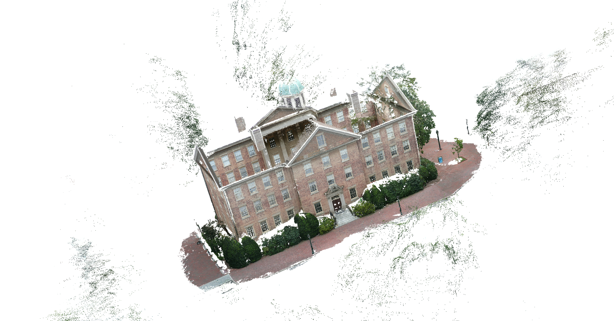

## 代码目录结构

- cc-pipeline       // 对应使用ContextCapture进行三维重建的方法，需要先自行安装cc，安装包在网盘
- DPT-main         // 深度估计算法，模型在网盘，详见对应readme
- RPMNet            // 同源点云配准算法，模型在网盘，参考[yewzijian/RPMNet: RPM-Net: Robust Point Matching using Learned Features (CVPR2020) (github.com)](https://github.com/yewzijian/RPMNet)
- tools                  // 一系列处理工具，因时间原因没有写成接口，后续有需要的uus可以自行修改
- colmap-pipeline.py            // colmap接口，详见[COLMAP — COLMAP 3.9-dev documentation](https://colmap.github.io/index.html)
- BinocularDisparity             // 双目深度估计算法，包含生成点云的方法，显存需求较大

## tools说明

文件名显示表明了方法的作用，部分函数需要根据实际使用的相机内参和对应的成像结果调整对应参数，如rgbd2ply.py中的图片HW参数和相机内参矩阵参数

ply_vis.py为使用open3d可视化pointcloud和mesh的方法，通过读取ply格式文件进行可视化，同时包含了移除异常点（outlier）的函数，以及体素下采样函数，函数末尾包含保存点云和mesh模型的代码，可以根据需要调用

## RPMNet

RPMNet是一种基于modelnet40训练的同源点云配准方法，效果较优，但也存在更为优越的方法，如DGR，建议关注sota模型

## colmap

一个非常好用的一体化三维重建工具，提供了简易的api调用，如pipeline所示，同时提供了图形化界面的开源项目，效果也不错，适合用来上手，详见https://colmap.github.io/index.html

colmap可以在不提供相机内参的情况下执行，但有具体的相机内参会更好，如果还能得到外参那么会锦上添花

建议在Linux端编译colmap

colmap提供了一个sample数据集，其中一个demo已传至网盘pcd-dataset中，具体名为pc-south-building，使用colmap方法dense重建后的效果如图

## ContextCapture

强大的三维重建方法，提供api支持和图形化界面，具体调用方法如cc-pipeline中automaster.py所示，需要根据自己的需要如输出格式（obj/ply/fbx....）修改对应参数，调用api需要先安装whl文件并安装cc，文件已传网盘

## DPT-main 

单视图深度估计算法，作为深度估计较为高效的方法，用作将rgb图像转为点云数据的中间过程

## BinocularDisparity

以 STereo TRansformer(STTR)为pipeline的双目深度估计算法，与DPT算法相比效果较好，并包含了从双目rgb图像到单视角三维点云映射的pipeline，需要自行更改方法相关参数，模型在网盘，具体内容参考STTR官方开源项目

## 三维模型可视化方法

直接使用open3d进行可视化，或者借助Blender，unity，meshlab等工具进行可视化

## 模型格式说明

mesh指的是网格模型，物体表面由多边形网格组成

点云指的是由点的集合所组成的物体，点是离散的

## 关于点云模型

点云模型可以借助open3d进行体素下采样后再可视化，网盘vedio中所展示的两种不同数量的点云（18万个点和72万个点）即由两种不同的采样率所产生

## 数据采集注意事项

- 注意采样时图像尽量采取高的重叠率，至少30%，更细致的信息请参考colmap或cc官方文档
- 采集过程光线强弱变化对模型质量有影响，尽量在光线稳定时采集，同时光线不宜过亮
- 注意剔除有残影或模糊的图像
- 如果物体由内外环组成，则需要从在内外圈采集图像外，从斜上方再次采集，否则外圈物体易附着在内圈上
- 注意不同类型深度相机的成像原理，注意对应的成像环境要求
- 条件允许的话，大场景建议采用无人机航拍，上图中的unity项目原始图像即为大疆无人机航拍所得

## 网盘链接

链接：https://pan.baidu.com/s/1E-dz2AE0-nIUbHsXmSNguw 
提取码：lbek

## Unity应用拓展

相关的模型文件可以导入到unity做拓展开发，这里只提供一张效果图，原始图像采集和unity项目由本人与另外两名同学共同实现~

